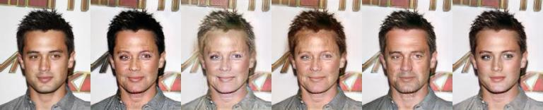
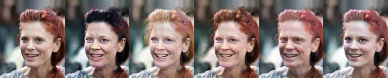
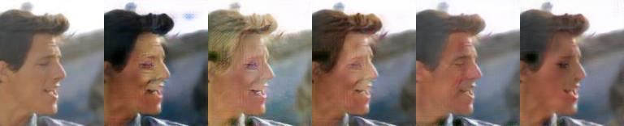
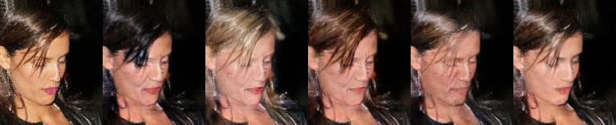

# StarGAN-PyTorch

### Overview

This repository contains an op-for-op PyTorch reimplementation of [StarGAN: Unified Generative Adversarial Networks for Multi-Domain Image-to-Image Translation](https://arxiv.org/abs/1711.09020v3).

## Table of contents

- [StarGAN-PyTorch](#stargan-pytorch)
    - [Overview](#overview)
    - [Table of contents](#table-of-contents)
    - [Download weights](#download-weights)
    - [Download datasets](#download-datasets)
    - [How Test and Train](#how-test-and-train)
      - [Train StarGAN-CelebA-128x128](#train-stargan-celeba-128x128)
      - [Resume train StarGAN-CelebA-128x128](#resume-train-stargan-celeba-128x128)
    - [Result](#result)
    - [Contributing](#contributing)
    - [Credit](#credit)
        - [StarGAN: Unified Generative Adversarial Networks for Multi-Domain Image-to-Image Translation](#stargan-unified-generative-adversarial-networks-for-multi-domain-image-to-image-translation)

## Download weights

```shell
$ bash ./scripts/download_weights.sh StarGAN-CelebA-128x128
```

## Download datasets

```shell
$ bash ./scripts/download_dataset.sh CelebA
```

Please refer to `README.md` in the `data` directory for the method of making a dataset.

## How Test and Train

### Test one image

```bash
$ python3 inference.py
```

### Train StarGAN-CelebA-128x128

```bash
python3 train.py --config_path ./configs/train/CelebA_128x128.yaml
```

### Resume train StarGAN-CelebA-128x128

Modify the `./configs/train/CelebA_128x128.yaml` file.

- line 44: `RESUMED_G_MODEL` change to `samples/StarGAN-CelebA-128x128/g_epoch_XXX.pth.tar`.
- line 45: `RESUMED_D_MODEL` change to `samples/StarGAN-CelebA-128x128/d_epoch_XXX.pth.tar`.

```bash
python3 train.py --config_path ./configs/train/CelebA_128x128.yaml
```

## Result







### Contributing

If you find a bug, create a GitHub issue, or even better, submit a pull request. Similarly, if you have questions, simply post them as GitHub issues.

I look forward to seeing what the community does with these models!

### Credit

#### StarGAN: Unified Generative Adversarial Networks for Multi-Domain Image-to-Image Translation

_Yunjey Choi, Minje Choi, Munyoung Kim, Jung-Woo Ha, Sunghun Kim, Jaegul Choo_ <br>

**Abstract** <br>
Recent studies have shown remarkable success in imageto-image translation for two domains. However, existing
approaches have limited scalability and robustness in handling more than two domains, since different models should
be built independently for every pair of image domains. To address this limitation, we propose StarGAN, a novel and
scalable approach that can perform image-to-image translations for multiple domains using only a single model.
Such a unified model architecture of StarGAN allows simultaneous training of multiple datasets with different domains
within a single network. This leads to StarGAN’s superior quality of translated images compared to existing models as
well as the novel capability of flexibly translating an input image to any desired target domain. We empirically demonstrate the effectiveness of our
approach on a facial attribute transfer and a facial expression synthesis tasks.

[[Paper]](https://arxiv.org/pdf/1711.09020v3) [[Code(PyTorch)]](https://github.com/yunjey/stargan)

```
@misc{choi2018stargan,
      title={StarGAN: Unified Generative Adversarial Networks for Multi-Domain Image-to-Image Translation}, 
      author={Yunjey Choi and Minje Choi and Munyoung Kim and Jung-Woo Ha and Sunghun Kim and Jaegul Choo},
      year={2018},
      eprint={1711.09020},
      archivePrefix={arXiv},
      primaryClass={cs.CV}
}
```